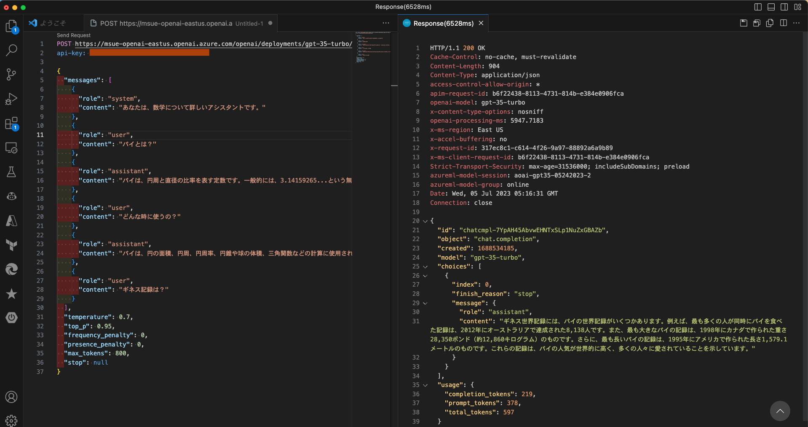

# セルフペースド ハンズオン資料

プロンプトベースのモデルを体験してみましょう。ここでは、GPT-3.5のモデルを利用して、チャット（会話）形式でAzure OpenAIを試す手順について紹介します。

## 注意事項

Azure OpenAI Serviceはトークン数などに制限があります。詳しくは、下記ドキュメントをご参考ください。

- [Azure OpenAI Service のクォータと制限 - Azure Cognitive Services | Microsoft Learn](https://learn.microsoft.com/ja-jp/azure/cognitive-services/openai/quotas-limits)

## 環境準備

1. Azure OpenAI Service の使用申請

ご自身の Azure サブスクリプションで Azure OpenAI Service を実行する場合、事前に申請が必要です（2023/7現在）。次のリンクから申請を行ってください。承認には数日かかる場合があります。

- [Request Access to Azure OpenAI Service](https://aka.ms/oai/access)

2. Azure OpenAI Service の作成とモデルのデプロイ

Azure OpenAI Serviceを利用するには、Azureポータル、もしくはAzureCLIなどを使用して Azure OpenAI Service リソース及びモデルを作成する必要があります。次のリンクの内容に従って作成してください。

モデルを作成する時、モデルは次のように作成してください。

|選択するモデル|指定するモデル名|
|---|---|
|gpt-35-turbo|gpt-35-turbo|

- [Azure OpenAI を使用してリソースを作成し、モデルをデプロイする](https://learn.microsoft.com/ja-jp/azure/cognitive-services/openai/how-to/create-resource?pivots=web-portal)

## Azure OpenAI Studioを開く

まず、Azure OpenAI Studioを開きましょう。

- https://oai.azure.com/

## デプロイを確認する

次に、Azure OpenAI Serviceを利用するにはまず、モデルをデプロイする必要があります。

本ハンズオンでは、すでにデプロイを済ませてあるので、Azure OpenAI Studioの「デプロイ」画面を開き、GPT-3.5のモデル（「モデル名」に`gpt-35-turbo`と表示されている）のデプロイがあることを確認しておきましょう。


## モデルを試す

それでは早速、プレイグラウンドでモデルを使ってみましょう。

まず、Azure OpenAI Studioで「チャット」画面を開きます。

ChatGPTのプレイグラウンドでは、「アシスタント セットアップ」「チャット セッション」「Configuration」のパネルがあります。


さいしょに、「Configuration」の「デプロイ」の選択が、前述で確認したものであることを確認してください。もし異なる場合は、選択し直してください。

それでは、「アシスタント セットアップ」で、セットアップを行いましょう。

「システム メッセージ」では、アシスタントの性格や、どんな振る舞いをさせるかや応答に含めてほしいコンテキストを指定します。まずは、「Use a system message template」のプルダウンから、「Empty Example」を選択してみましょう。

選択したら、「変更の保存」を選択して保存してください。「システム メッセージを更新しますか?」というポップアップが表示された場合、システム メッセージの更新によりチャット セッションでの会話の履歴が消去されることになる旨を確認されます。問題ない場合は、「続行」を選択して進めてください。

「チャット セッション」でアシスタントと会話をしてみましょう。「User message」から、以下のメッセージを順に送信してみてください。

- こんにちは
- サインについて教えて
- パイとは？
- どんな時に使うの？

さし障りのない応答が返ってきたかと思います。


また、「パイとは？」の後に「どんな時に使うの？」と問いかけると、直前のパイに関する応答が得られたと思います。このように、会話に特化したモデルでは会話の流れを考慮して応答を返させることができます。


それでは、アシスタントの振る舞いを指定してみましょう。「システム メッセージ」に下記を入力して、「変更の保存」を行います。

```
あなたは、数学について詳しいアシスタントです。
```

再度同じ会話をしてみます。

- こんにちは
- サインについて教えて
- パイとは？
- どんな時に使うの？

数学について詳しい会話になりましたか？


なお、必ずしもシステム メッセージに忠実な応答が返されるわけではありませんが、アシスタントの振る舞いを細かく指示できることが確認できたかと思います。

## トークンについて確認する

Azure OpenAI Serviceでは、1リクエストにつき利用できる「トークン」の上限が決まっており、送信する内容と応答で消費します。モデルによってトークンの最大値が異なり、本ハンズオンで使用している`gpt-35-turbo`では、 _4,096_ です。

実際のトークン量は内容により算出され、Azure OpenAI Studioではその目安を確認することができます。チャットの場合、「Configuration」の「デプロイ」タブの「現在のトークン数」からその目安を確認することができます。オンカーソルでその内訳も確認できます。

## パラメータを試す

次に、パラメータを試してみましょう。


「Configuration」の「パラメータ」タブを開いてみます。設定できるパラメータのうち、主要なものを紹介します。


| パラメータ | 説明 |
|----|----|
| 最大応答 `Max response` | Azure OpenAI Serviceが返す応答の最大トークン数を指定する |
| 温度 `Temperature` | ランダム性を制御する。値を下げると反復的で決定的な応答が増え、値を上げると予期しない応答や独創的な応答が増えるとされている。 |
| 上位 P `Top P` | ランダム性を制御する。値を下げると、トークンの選択が可能性が高いトークンに絞り込まれ、値を上げると、可能性の高いトークンと低いトークンの両方から選択するとされている。 |

`Temperature`と`Top P`はどちらもランダム性を制御するパラメータですが、検証時は片方ずつ試すことが推奨されています。

他のパラメータ含め、詳細についてはドキュメン語をご参照ください。

- [チャット セッション - 設定 | クイック スタート - Azure OpenAI Service で ChatGPT と GPT-4 の使用を開始する - Azure OpenAI Service | Microsoft Learn](https://learn.microsoft.com/ja-jp/azure/cognitive-services/openai/chatgpt-quickstart?tabs=command-line&pivots=programming-language-studio#settings)
- [チャット入力候補 | Azure OpenAI Service の REST API リファレンス - Azure OpenAI | Microsoft Learn](https://learn.microsoft.com/ja-jp/azure/cognitive-services/openai/reference#chat-completions)

## 自由に試してみる

ここまでで基本的な使い方をご紹介しました。ここからはぜひ自由に試してみてください。

プロンプトのコツはこちらのドキュメントをご参考ください。

- [プロンプト エンジニアリングの概要 | Azure OpenAI Service - Azure OpenAI | Microsoft Learn](https://learn.microsoft.com/ja-jp/azure/cognitive-services/openai/concepts/prompt-engineering)

## REST APIで実行してみる

Azure OpenAI Serviceは、REST APIから利用できます。Azure OpenAI Studioからサンプルコードを確認できるので、それを元にREST APIでも動作を確認してみましょう。

まずは、2つ以上の会話をした上で、「チャット セッション」パネルの上部の「コードを表示」を選択します。

すると、Pythonでのサンプルコードが表示されるので、「json」に切り替えてみましょう。REST APIへ指定するリクエストボディをJSON形式で確認することができます。

例えば、これは「システム メッセージ」に数学アシスタントを指定し、「パイとは？」「どんな時に使うの？」と会話を続けた後のリクエストボディです。

```json
{
  "messages": [
    {
      "role": "system",
      "content": "あなたは、数学について詳しいアシスタントです。"
    },
    {
      "role": "user",
      "content": "パイとは？"
    },
    {
      "role": "assistant",
      "content": "パイは、円周と直径の比率を表す定数です。一般的には、3.14159265...という無限に続く小数で表されます。パイは円の性質に関する多くの公式で使用され、数学や科学の多くの分野で重要な役割を果たしています。"
    },
    {
      "role": "user",
      "content": "どんな時に使うの？"
    },
    {
      "role": "assistant",
      "content": "パイは、円の面積、円周、円周率、円錐や球の体積、三角関数などの計算に使用されます。たとえば、円の面積を求める公式「円の面積 = パイ × 半径の二乗」や、円の円周を求める公式「円周 = パイ × 直径」、球の表面積や体積を求める公式にもパイが登場します。また、三角関数の中には、円の中に内接する正三角形の辺の長さと半径の比がパイの値となる公式もあります。このように、数学や科学の様々な分野でパイが使われています。"
    }
  ],
  "temperature": 0.7,
  "top_p": 0.95,
  "frequency_penalty": 0,
  "presence_penalty": 0,
  "max_tokens": 800,
  "stop": null
}
```

各パラメータの指定に加え、`messages`には「システム メッセージ」やそれまでの履歴が含まれていることが確認できます。

### message の解説
「システム メッセージ」は`messages.[].role`に`system`を指定した上で、`memssages.[].content`で指定します。

```json
{
  "messages": [
    {
      "role": "system",
      "content": "あなたは、数学について詳しいアシスタントです。"
    },
    ...
  ],
```

履歴は、ユーザーの入力とモデル（アシスタント）の応答をそれぞれ入力します。

- ユーザーの入力は`messages.[].role`に`user`を指定した上で、`memssages.[].content`で指定します。
- モデル（アシスタント）の応答は`messages.[].role`に`assistant`を指定し、`memssages.[].content`で指定します。

```json
{
  "messages": [
    ...
    {
      "role": "user",
      "content": "パイとは？"
    },
    {
      "role": "assistant",
      "content": "パイは、円周と直径の比率を表す定数です。一般的には、3.14159265...という無限に続く小数で表されます。パイは円の性質に関する多くの公式で使用され、数学や科学の多くの分野で重要な役割を果たしています。"
    },
    {
      "role": "user",
      "content": "どんな時に使うの？"
    },
    {
      "role": "assistant",
      "content": "パイは、円の面積、円周、円周率、円錐や球の体積、三角関数などの計算に使用されます。たとえば、円の面積を求める公式「円の面積 = パイ × 半径の二乗」や、円の円周を求める公式「円周 = パイ × 直径」、球の表面積や体積を求める公式にもパイが登場します。また、三角関数の中には、円の中に内接する正三角形の辺の長さと半径の比がパイの値となる公式もあります。このように、数学や科学の様々な分野でパイが使われています。"
    }
  ],
  ...
}
```

この会話を続けてさらに回答を得る場合は、最後に`messages.[].role`に`user`を指定し、`content`に質問の文字列を追加します。例えば、以下は「ギネス記録は？」と会話を続ける場合の入力です。

```json
{
  "messages": [
    ...
    {
      "role": "user",
      "content": "ギネス記録は？"
    }
  ],
```

## Postmanで実行する
この画面からエンドポイントとキーも取得できるので、Postmanから実行してみましょう。

| 項目 | 説明 |
|----|----|
| メソッド | `POST` |
| エンドポイント | コピーしたエンドポイント |
| 認証 | 「API Key」を選択し、「Key」に`api-key`、「Value」にコピーしたキー、「Add to」に「Header」を指定する | |
| リクエストボディ（JSON） | サンプルコードをもとに組み立てたJSON |


すると、以下のようなレスポンスを得られます。`choices.[].message.role`に`assistant`が指定され、`choices.[].message.content`に応答が含まれているのがわかります。


```json
{
  "id": "chatcmpl-7UF45zcdrdm3D2PkUAQa88sq6TnOP",
  "object": "chat.completion",
  "created": 1687442105,
  "model": "gpt-35-turbo",
  "choices": [
    {
      "index": 0,
      "finish_reason": "stop",
      "message": {
        "role": "assistant",
        "content": "ギネス世界記録には、パイに関連する様々な記録が存在します。例えば、最も多くの人が同時にパイを投げた記録、最大のパイの直径を持つ記録、最も長いパイの列を作った記録、最も多くの種類のパイを1時間以内に作った記録などがあります。また、最も多くの人が参加したパイ食い競争の記録もあります。これらの記録は、パイに対する人々の愛着と楽しみを表しています。"
      }
    }
  ],
  "usage": {
    "completion_tokens": 181,
    "prompt_tokens": 378,
    "total_tokens": 559
  }
}
```

## VSCode の REST Client プラグインで実行する
VSCode の REST Client プラグインを使用して実行することもできます。 [REST Client プラグイン](https://marketplace.visualstudio.com/items?itemName=humao.rest-client)


これらの繰り返しで、GPT-3.5を用いた会話を実装することができます。

詳しくは、リファレンスをご確認ください。

- [Azure OpenAI Service の REST API リファレンス - Azure OpenAI | Microsoft Learn](https://learn.microsoft.com/ja-jp/azure/cognitive-services/openai/reference)

----

## [備考] 環境構築

- ブラウザ
- Azureアカウント
  - Azure OpenAI利用申請済みであること
- Postman
